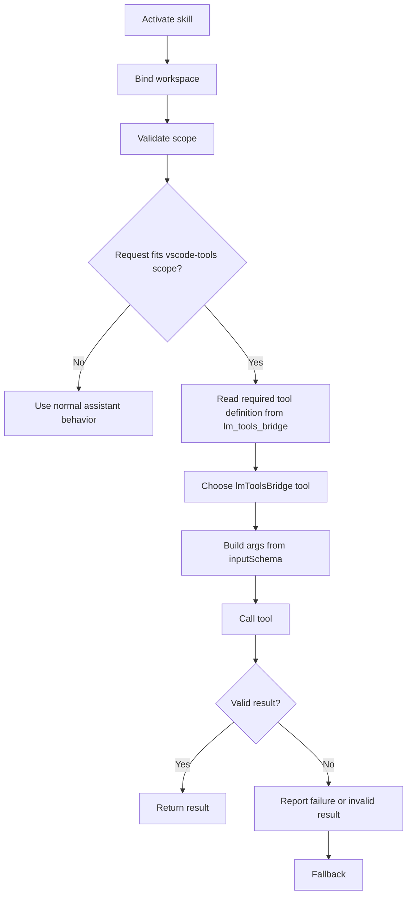

## Activation
- Initialize lmToolsBridge binding once per activation/session:
  - The MCP server name used by this skill is fixed as `lm_tools_bridge`.
  - Call `lmToolsBridge.requestWorkspaceMCPServer` to bind workspace and validate scope.
  - Follow the returned `guidance` from `requestWorkspaceMCPServer` as binding-specific instructions.
  - Do not use `list_mcp_resources` or `list_mcp_resource_templates` as a routine post-bind step. Only use them for diagnostics, discovery troubleshooting, or explicit visibility checks.
  - Read `lm-tools://tool/{name}` directly from `lm_tools_bridge` only for tools expected in the current task; otherwise load lazily before first use.
- Reuse a valid bind across calls; do not handshake again before every tool call.
- Re-run initialization when the workspace target changes.

## When To Use
- Use this skill for workspace file search, text search, directory-scoped or multi-file inspection, and requests that operate on the VS Code IDE itself through lmToolsBridge tools.
- Do not use this skill for normal explanation-only answers, generic shell tasks unrelated to vscode-tools, or requests that target paths outside validated workspace roots.

## Core Flow

1. Bind the workspace and validate scope.
2. Confirm the request belongs to workspace search, workspace inspection, or VS Code IDE actions handled by vscode-tools.
3. Read the required `lm-tools://tool/{name}` directly from `lm_tools_bridge`.
4. Prefer lmToolsBridge tools before shell fallback for matching requests.
5. Build arguments strictly from the retrieved `inputSchema` and invoke via `lmToolsBridge.callTool`.
6. Return the result when the call succeeds and the result is usable.
7. Report the failing tool or invalid result before any fallback.

## Routing Rules
- For directory-scoped, pattern-based, workspace-wide, and multi-file search or inspection, prefer tools exposed through lmToolsBridge first.
- For requests that operate on the VS Code IDE itself, prefer the matching lmToolsBridge tool before any shell-based workaround.
- When qgrepSearch-series tools are available, prefer them for repeated workspace text search. If a qgrep call waits or times out, check qgrep status before fallback.
- In multi-root workspaces, use `WorkspaceName/...` only when narrowing to one root; otherwise keep cross-root scope.
- Never call vscode-tools tools exposed via lmToolsBridge for paths outside validated workspace roots. Use non-lmToolsBridge fallback and explicitly report outside-workspace scope.

## Reporting And Fallback
- Use a lightweight reporting shape with these minimum fields:
  - `tool`: the lmToolsBridge tool used, or the failing tool before fallback
  - `scope`: the validated workspace root, `WorkspaceName/...`, or `non-lmToolsBridge scope`
  - `reason`: required for fallback, invalid results, partial discovery, or truncated output
- If output is capped or truncated, return the available result and suggest a narrower scope.
- Trigger fallback only when the tool call errors, returns empty output that clearly does not satisfy the request, returns incomplete or invalid information, or the user explicitly requests non-lmToolsBridge behavior.
- Never perform silent fallback. Always report the failing tool and the reason first.
- For workspace-wide fallback or any outside-workspace request, label the output as `non-lmToolsBridge scope` and report the exact fallback scope or path used.

## Examples
- Workspace text search: "Find `requestWorkspaceMCPServer` usages in this workspace" -> prefer an lmToolsBridge search tool, report the workspace root in `scope`, and only fallback if the tool errors or returns invalid results.
- Multi-root narrowing: "Search only in `ClientApp/...` for `callTool`" -> use `ClientApp/...` when the user clearly narrows to one root; otherwise keep cross-root scope.
- VS Code IDE action: "Open the file that defines `qgrepSearch` in VS Code" -> prefer the lmToolsBridge tool that operates on the IDE, not a shell workaround.
- Outside workspace or failed tool: "Search `D:\\temp\\notes` for `TODO`" -> do not use vscode-tools outside validated roots; label the result as `non-lmToolsBridge scope`, state the exact path, and include the fallback `reason`.
